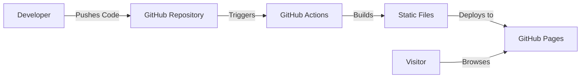

# Requirements

### Overview & Goals
The goal is to build a professional, high-performance portfolio website with a built-in blog, hosted entirely for free using modern web technologies.

### Scope
- **In Scope**: 
    - Personal portfolio landing page (About, Skills, Projects).
    - Fully functional blog system using Markdown.
    - Responsive design using Tailwind CSS.
    - Automated deployment pipeline via GitHub Actions.
    - Hosting on GitHub Pages (`yourusername.github.io`).
- **Out of Scope**: 
    - Custom domain purchase (using free `github.io` subdomain).
    - Paid CMS integrations.
    - Complex backend or database requirements.

### User Stories
- **As a developer**, I want a fast, SEO-friendly portfolio so that I can showcase my work to potential employers.
- **As a writer**, I want to easily publish technical blog posts using Markdown so that I can share my knowledge without dealing with complex UIs.
- **As a user**, I want to build this for $0 so that I don't have recurring hosting or maintenance costs.

### Functional Requirements
- **Landing Page**: Must include a hero section, skills overview, and project gallery.
- **Blog**: Must support Markdown/MDX, listing posts, and individual post pages.
- **Performance**: The site must be static and optimized for fast loading (Astro default).
- **Deployment**: Any push to the `main` branch must trigger a redeploy to the live site.

# Technical Design

### Current Implementation
The project is currently an empty directory. We are starting from scratch to build a static site using the Astro framework.

### Key Decisions
- **Framework: Astro**: Chosen for its "islands architecture" which results in zero-latency websites by shipping less JavaScript.
- **Styling: Tailwind CSS**: Utility-first CSS framework for rapid UI development and consistent design.
- **Content: Markdown/MDX**: Files are stored directly in the repository, making content version-controlled and free to host.
- **Hosting: GitHub Pages**: A free service from GitHub that hosts static files directly from a repository.

### Proposed Changes
We will implement a standard Astro project structure optimized for a developer portfolio.

#### File Structure
```text
/
├── src/
│   ├── components/       # Reusable UI parts (Card, Navbar, Footer)
│   ├── content/          # Blog posts (Markdown/MDX files)
│   │   └── blog/
│   ├── layouts/          # Page wrappers (BaseLayout.astro)
│   ├── pages/            # Routes (index.astro, blog/index.astro, [slug].astro)
│   └── styles/           # Global styles and Tailwind configuration
├── public/               # Static assets (images, favicon)
├── astro.config.mjs      # Astro configuration (GitHub Pages site/base settings)
└── .github/workflows/    # Deployment scripts (deploy.yml)
```

### Architecture Diagram
The following diagram shows the automated deployment flow:



### Risks & Mitigations
- **Asset Paths on GitHub Pages**: GitHub Pages often hosts sites at a subpath (e.g., `/my-portfolio/`). 
    - *Mitigation*: Configure `base` in `astro.config.mjs` to ensure assets and links resolve correctly.
- **GitHub Actions Minutes**: Free accounts have limited minutes.
    - *Mitigation*: Astro builds are extremely fast, and the official action is optimized to stay well within free tier limits.

# Delivery Steps

### * Step 1: Initialize Astro Project & Install Dependencies
The foundation of the website is established with all necessary tools.

- Scaffold a new Astro project using the official `blog` template.
- Install and configure Tailwind CSS for styling.
- Set up the project directory structure (`src/pages`, `src/content`, `src/components`).
- Initialize a Git repository for version control.

###   Step 2: Build Portfolio Landing Page & Layout
The main landing page is professional, responsive, and contains all essential portfolio information.

- Create a `Layout.astro` component for consistent site structure (Navbar, Footer).
- Build the `Hero` section with an introduction and profile image placeholder.
- Implement the `Skills` and `Featured Projects` sections on the homepage.
- Ensure the design is mobile-friendly using Tailwind's responsive utilities.

###   Step 3: Implement Blog System & Content Collections
The blog is functional and ready for writing technical articles.

- Configure Astro's Content Collections for the blog.
- Create a `Blog` index page listing all posts sorted by date.
- Design the dynamic `[slug].astro` page for rendering individual Markdown/MDX posts.
- Add sample blog posts to verify the rendering and styling.

###   Step 4: Configure & Deploy to GitHub Pages
The website is live and accessible via a public URL at no cost.

- Update `astro.config.mjs` with the `site` and `base` URLs for GitHub Pages.
- Create the `.github/workflows/deploy.yml` file for automated builds and deployments.
- Provide instructions on how to enable GitHub Pages in the repository settings.
- Verify the live site for correct asset loading and navigation.